# Introducción

Se refiere a un tipo de aprendizaje en el que se proporcionan al algoritmo datos etiquetados, es decir, conjuntos de datos que contienen ejemplos de entradas y salidas deseadas. El objetivo es entrenar un modelo que pueda predecir las salidas correspondientes para nuevas entradas.

En el aprendizaje supervisado, el algoritmo aprende a mapear las entradas a las salidas con ayuda al dataset de entrenamiento, y luego utiliza este conocimiento para predecir las salidas para nuevas entradas. Los ejemplos de entrenamiento consisten en pares de entrada-salida, donde la entrada puede ser un vector de características que describe un objeto, y la salida es la etiqueta o el valor deseado que el modelo intenta predecir.

Los algoritmos de aprendizaje supervisado se dividen generalmente en dos categorías principales: los algoritmos de regresión, que predicen valores continuos, y los algoritmos de clasificación, que predicen clases o etiquetas discretas.

**Algunos ejemplos comunes de algoritmos de aprendizaje supervisado incluyen:**

-   Regresión lineal

-   Regresión logística

-   Máquinas de vectores de soporte (SVM)

-   Árboles de decisión Bosques aleatorios Redes neuronales artificiales

El aprendizaje supervisado es esencial en la resolución de una amplia variedad de problemas en ciencia de datos y aprendizaje automático, como reconocimiento de voz, detección de fraudes, diagnósticos médicos, análisis de sentimientos y muchas otras aplicaciones. Su importancia radica en la capacidad de entrenar modelos precisos y predictivos para realizar tareas complejas y tomar decisiones basadas en datos.

# Metodología

### Relevancia del Aprendizaje Supervisado en Ciencia de Datos y Aprendizaje Automático

El aprendizaje supervisado es ampliamente utilizado en la ciencia de datos y la ingeniería del aprendizaje automático debido a su capacidad para realizar tareas de predicción y clasificación precisas en una amplia gama de dominios. Al aplicar algoritmos de aprendizaje supervisado, los científicos de datos pueden desarrollar modelos predictivos y clasificadores que pueden hacer predicciones sobre datos futuros o no vistos con un alto grado de precisión. Estos modelos son fundamentales en áreas como la detección de fraudes, el análisis de sentimientos, la recomendación de productos, la detección de spam, la visión por computadora, entre otros campos, lo que los convierte en herramientas esenciales para extraer conocimientos y tomar decisiones informadas a partir de conjuntos de datos complejos.

### Algoritmos

Es un conjunto de pasos o reglas definidas y ordenadas para resolver un problema en específico. Los algoritmos son esenciales en la programación y la ciencia de la computación, ya que proporcionan un plan claro y sistemático.

Para entender un poco mas debes tener en cuenta los siguientes datos:

1.  **Secuencia de Pasos:** Un algoritmo es una secuencia ordenada de pasos o instrucciones que se deben seguir para completar una tarea.

2.  **Entradas y Salidas:** Un algoritmo puede tomar cero o más entradas y produce una salida. Las entradas son datos que se proporcionan al algoritmo para procesar, y la salida es el resultado o la solución generada por el algoritmo.

3.  **Determinismo:** Los algoritmos son deterministas, lo que significa que para un conjunto dado de entradas, un algoritmo siempre producirá la misma salida. No hay lugar para la aleatoriedad en la ejecución de un algoritmo.

4.  **Finitud:** Un algoritmo debe ser finito, lo que significa que debe terminar después de un número finito de pasos. No debe entrar en un bucle infinito.

5.  **Efectividad:** Un algoritmo debe resolver el problema para el cual fue diseñado. Además, debe ser práctico y eficiente en términos de tiempo y recursos computacionales.

### ¿Qué es un módelo de entrenamiento?

Puede ser un algoritmo o conjunto de algoritmos que ha sido ajustado (o entrenado) en base a datos de entrada para realizar una tarea específica. El proceso de entrenamiento implica ***proporcionar al modelo un conjunto de ejemplos*** (datos de entrada) junto con las respuestas correctas correspondientes (etiquetas o salidas esperadas). ***El modelo aprende patrones y relaciones a partir de estos ejemplos para hacer predicciones sobre nuevos datos***.

### ¿Qué es un módelo de Prueba?

Después de entrenar un modelo utilizando un conjunto de entrenamiento, es esencial evaluar su rendimiento en datos que no ha visto durante el entrenamiento. Para esto, se utiliza un conjunto de prueba. Este conjunto de prueba consta de datos no utilizados durante la fase de entrenamiento, y se emplea para medir la capacidad del modelo para generalizar y hacer predicciones precisas en nuevos datos.

### Sobreajuste

El sobreajuste, también conocido como overfitting en inglés, es un fenómeno en el aprendizaje automático en el cual un modelo se ajusta demasiado a los datos de entrenamiento, capturando patrones que no son representativos de la verdadera relación subyacente entre las variables. Esto puede llevar a un rendimiento deficiente del modelo cuando se enfrenta a nuevos datos que no se han utilizado durante el entrenamiento.

### Subajuste

Tambien conocido e inglés como "underfitting". El subajuste ocurre cuando un modelo es demasiado simple para capturar la complejidad de los datos de entrenamiento y, como resultado, no logra aprender la verdadera relación subyacente entre las variables.

En el subajuste, el modelo no se ajusta lo suficiente a los datos de entrenamiento, lo que significa que no puede realizar predicciones precisas ni en los datos de entrenamiento ni en nuevos datos no vistos.

### Validación cruzada

La validación cruzada (cross-validation en inglés) es una técnica utilizada en aprendizaje automático y estadísticas para evaluar el rendimiento de un modelo y reducir el riesgo de sobreajuste. El propósito principal de la validación cruzada es obtener una estimación más precisa del rendimiento del modelo en datos no vistos.

El procedimiento básico de validación cruzada implica dividir el conjunto de datos en varios subconjuntos y realizar múltiples evaluaciones del modelo, utilizando diferentes combinaciones de subconjuntos como conjuntos de entrenamiento y prueba. El enfoque más común es la validación cruzada k-fold, donde el conjunto de datos se divide en k subconjuntos (folds), y el modelo se entrena y evalúa k veces, cada vez utilizando un conjunto diferente como conjunto de prueba y el resto como conjunto de entrenamiento.

Las métricas de rendimiento son medidas cuantitativas utilizadas para evaluar el desempeño de un modelo predictivo o clasificador en aprendizaje automático y estadísticas. Estas métricas proporcionan información sobre la calidad de las predicciones realizadas por el modelo en comparación con los valores reales. La elección de las métricas de rendimiento depende del tipo de tarea (clasificación, regresión, etc.) y de los objetivos específicos del problema.

### **Clasificación Binaria:**

1.  **Exactitud (Accuracy):** Mide la proporción de predicciones correctas sobre el total de predicciones.

    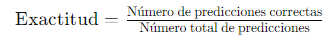

2.  **Precisión (Precision):** Mide la proporción de verdaderos positivos sobre la suma de verdaderos positivos y falsos positivos.

    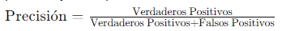

3.  **Recall (Recuperación o Sensibilidad):** Mide la proporción de verdaderos positivos sobre la suma de verdaderos positivos y falsos negativos.

    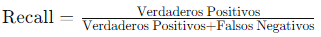

4.  **F1-Score:** Es la media harmónica de precisión y recuperación.

    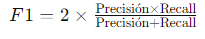

### **Clasificación Multiclase:**

-   Se pueden utilizar extensiones de las métricas de clasificación binaria, como la macro-precisión, la macro-recuperación y la micro-precisión.

### **Regresión:**

1.  **Error Cuadrático Medio (MSE):** Mide la media de los cuadrados de las diferencias entre las predicciones y los valores reales.

    

2.  **Error Absoluto Medio (MAE):** Mide la media de las diferencias absolutas entre las predicciones y los valores reales.

    

3.  **Coeficiente de Determinación** : Indica la proporción de la varianza en la variable dependiente que es predecible a partir de las variables independientes.

    

Estas son solo algunas de las métricas de rendimiento comunes, y la elección de la métrica adecuada depende de la naturaleza específica del problema y los objetivos del modelo.

### Regresión

Es un tipo de modelo utilizado para predecir valores numéricos basándose en unos datos de entrada. La regresión busca establecer una relación matemática entre las variables de entrada y una variable objetivo.

Algunos puntos clave sobre la regresión en el aprendizaje supervisado:

1.  **Objetivo Continuo:** A diferencia de la clasificación, donde el objetivo es predecir una etiqueta categórica, la regresión se utiliza cuando el objetivo es una variable continua. Por ejemplo, predecir el precio de una casa, la temperatura, o la cantidad de ventas.

2.  **Modelo Matemático:** En este caso se busca encontrar la mejor función matemática que describa la relación entre las variables de entrada y la variable de salida. Este modelo puede ser lineal o no lineal, dependiendo de la naturaleza de los datos.

3.  **Parámetros Ajustables:** Estos suelen tener parámetros ajustables que se modifican durante el entrenamiento del modelo para minimizar la diferencia entre las predicciones del modelo y los valores reales observados en los datos de entrenamiento.

4.  **Evaluación del Rendimiento:** La calidad de un modelo de regresión se evalúa típicamente mediante métricas como el error cuadrático medio (MSE), el coeficiente de determinación (R-squared), o el error absoluto medio (MAE). Estas métricas cuantifican qué tan bien el modelo se ajusta a los datos observados.

Ejemplos comunes de modelos de regresión incluyen la regresión lineal, regresión polinómica, regresión de vecinos más cercanos (KNN), y regresión de máquinas de soporte vectorial (SVR), entre otros.

### Clasificación

El objetivo de la clasificación es asignar una etiqueta o categoría a un conjunto de datos de entrada. Algunos datos importantes para entender la clasificación son:

1.  **Objetivo Categórico:** La clasificación se utiliza cuando el resultado deseado es una etiqueta o categoría. Por ejemplo, determinar si un correo electrónico es spam o no spam, clasificar imágenes de dígitos escritos a mano en sus respectivos números, o predecir si un tumor es benigno o maligno.

2.  **Modelo de Decisión:** Los modelos de clasificación buscan aprender una función que pueda tomar datos de entrada y asignarlos a categorías predefinidas. La salida del modelo es una etiqueta de clase.

3.  **Aprendizaje de Patrones:** Durante el entrenamiento, el modelo analiza ejemplos de datos etiquetados para aprender patrones que puedan generalizarse a nuevas instancias.

4.  **Evaluación del Rendimiento:** La calidad de un modelo de clasificación se evalúa mediante métricas como precisión, recall, F1-score, matriz de confusión y área bajo la curva ROC, entre otras. Estas métricas indican cómo de bien el modelo puede distinguir entre las clases.

Ejemplos comunes de modelos de clasificación incluyen máquinas de soporte vectorial (SVM), árboles de decisión, regresión logística, y algoritmos de vecinos más cercanos (KNN), entre otros.

## Metodología

El presente trabajo fue realizado para la materia Electiva tres del programa de Ingenieria Biomedica, el docente nos suministro el paquete **DynamicCancerDriverKM** el cual se encuentra en su GitHub.

1.  Antes de instalar cualquier paquete, es una buena práctica configurar un repositorio de CRAN.
2.  Cargar paquete **`devtools`** en R es una herramienta útil para el desarrollo de paquetes, la instalación de paquetes directamente desde repositorios de GitHub, y la carga de paquetes que se encuentran en desarrollo o no están disponibles en el repositorio de CRAN
3.  Instalar el codigo desde GitHub con devtools

**Paso 1:** Primer Utiliza la función merge para combinar las matrices BRCA_normal y BRCA_PT basándose en las columnas en comun, al final pido que incluir todas las filas, tanto las que tienen coincidencias como las que no.

**Paso 2:** Elimino las columas que no me interesan y dejo solo genes y sample.

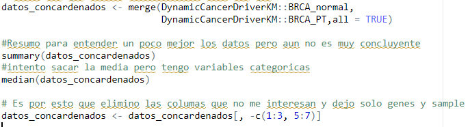{width="460"}

**Paso 3:** Sacar el numero mas alto entre los datos, exclui a la primera columna (sample) y multiplico por 0.00035 que es el 0.035% , na para excluir estos valores, con esto puedo revisar que genes estan expresados calculo la media para tener un punto de partida y luego sacar un valor, lo intente solo con la media aritmetica pero me enrrede, por eso tuve que calcular un valor y multiplicar Tuve que volver a eliminar sample_type para refinar el dataframe

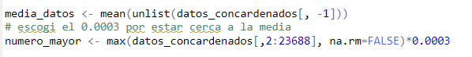{width="375"}

***Lo cargo como imagen ya que al colocar el codigo imprimia tambien la salida lo que haria el documento muy extenso***

**Paso 4:** Creo una copia donde pondre 1 a los datos que pasen el umbral establecido y cero los que no. Utilice apply para que tome cada columna x y utilice ifelse para asignar 1 si el valor es mayor que el numero establecido como umbral

**Paso 5:** Limpie los datos el eliminar losgenes que no estan expresados por lo menos en el 20%

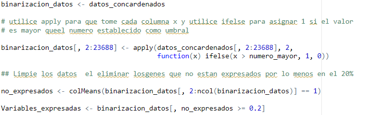{width="372"}

**Paso 6:** Calcule las medias de cada columna de la matriz booleana resultante, donde la media representa el porcentaje de unos en cada columna.

**Paso 7:** renombre las variables para que concuerden respecto a HGNC.symbol para poder concardenarlas y nuevamente para acceder por columnas con colnames.

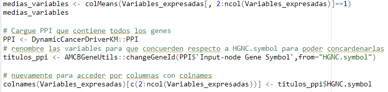{width="412"}

**Paso 9:**

Luego con PPI **DynamicCancerDriverKM:: PPI** debia escoger los 100 genes principales con los grados de conexión más altos. Para esto fue necesario lo siguiente:

1.  Agrupar los datos entre **`Input-node Gene Symbol`** y **`Output-node Gene Symbol` individualmente**
2.  Con **`Summarise`** resumi los datos por agrupación y con la función **`n()`** solicito que cuente el numero de observaciones en cada grupo.
3.  Asigné el resultado a una columna resultante llamada NN
4.  Organice con **`Arrange`** los datos de manera descendente para lo que utilice **`(desc(NN))`**
5.  Despues de tener ambos resultados organizados, **`Input-node Gene Symbol`** y **`Output-node Gene Symbol`** y como ambos tenian una segunda columna **NN** solo faltaba renombrar alguna de las columnas, bien sea en Input o Output, yo escogi Output y lo renombre igual que el otro grupo **`Input-node Gene Symbol`** para que al sumar se reconocieran los encabezados tanto de Agrupar como de Agrupar_out.
6.  Combiné ambos resultados en una sola matriz pero aun no estaban sumadas las veces que se repetia cada gen con **`bind_rows`**.
7.  Agrupé nuevamente los genes y las veces que se repiten **`group_by`** y solicite el resumen con **`summarise`**

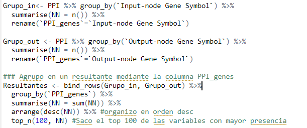{width="445"}

**Paso 10:** CAMBIO LOS TITULOS EN FUNCION DE HGNC

**Paso 11:** Accedo a los titulos de cada variable genica y Convertir los nombres de las variables en una matriz para unir con las resultantes

**Paso 12:** Creo la interseccion entre matriz ppi y matriz filtrada para empezar los modelos

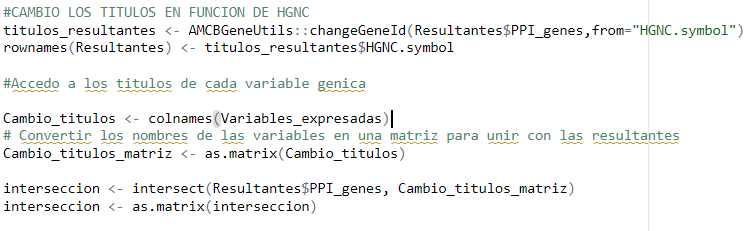{width="437"}

**Paso 13:** Establezco una semilla para garantizar la reproducibilidad de los resultados cuando se generan números aleatorios. Cada que ejecute el mismo código, obtengo los mismos resultados.

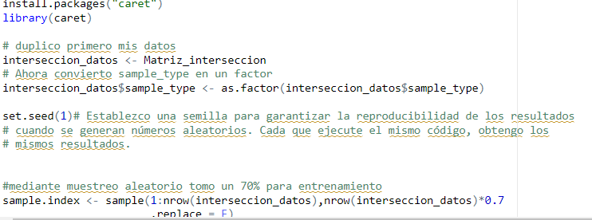

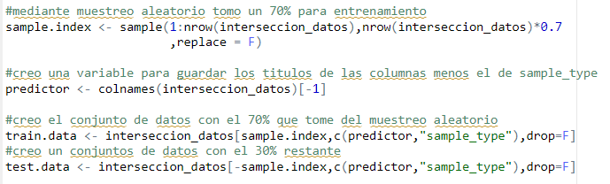

**Establezco control para el entrenamiento del modelo utilizando validación cruzada con una proporción del 70% para entrenamiento.**

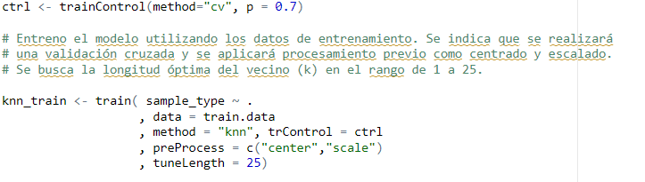{width="550"}

**Realiza predicciones en los datos de prueba utilizando el modelo entrenado.**

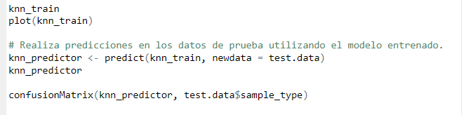{width="517"}

#### Retos en el presente trabajo

La mayor de las dificultades en el presente trabajo fue organizar los datos antes de empezar con los modelos ya que eran demasiados datos y organizar fue lo que mas me costo, adicional a la hora de hacer el documento en rmakdown así compilara en el código a veces arrojaba error por lo que para cumplir tuve que recurrir a cargar el código en imágenes.

### Conclusiones

Los modelos de prediccion pueden ser utilizados en multiples areas y es responsabilidad del ingeniero prepararse en el desarrollo de muevas estrategias de identificacion, procesamiento y desarrolo de una enfermedad tan letal como el cancer. Con estos modelos no solo podemos predecir cancer sino tambien muchas patologias mas.
